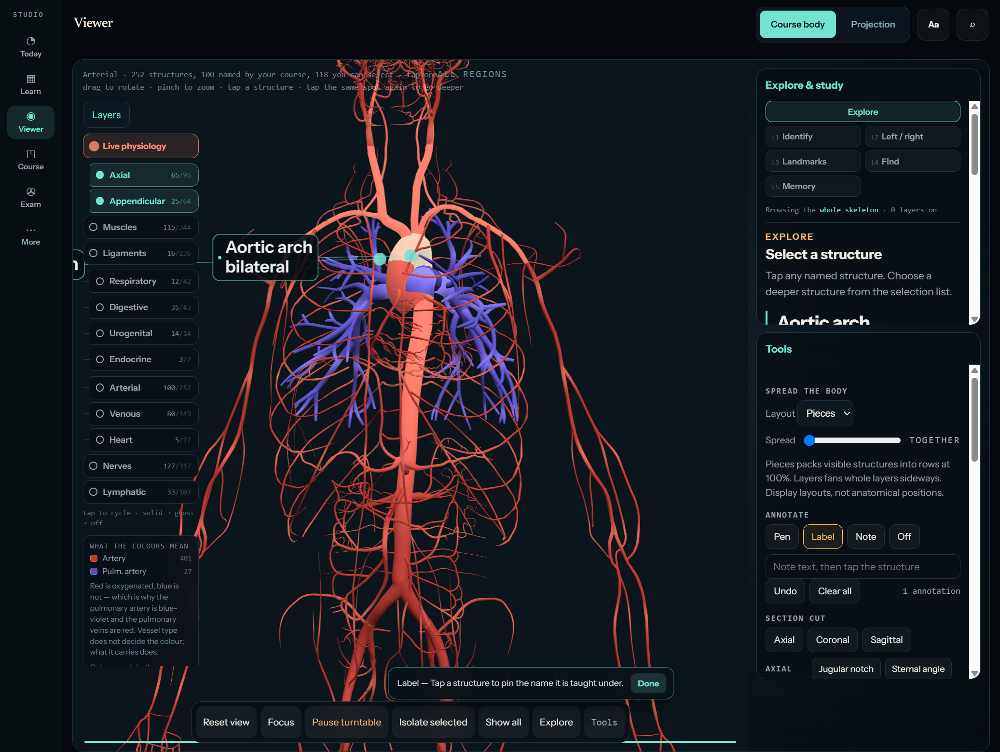

# Arterial pulse evidence — completed 2026-09-13

Scope: vessel pulse only. Baseline master `9b74153`; heart work remains separate.

## Outcome and gate

24 arterial candidates (21 systemic plus 3 pulmonary), 19 pulse frames and five
named glow fallbacks. The arch at 2.94 calibres passes the 2.5-calibre middle gate.
Self-clearance is centreline distance / sum of radii: resting contact is 1;
5% swell needs 1.05 and the gate uses 1.10 with a 5% fit allowance. The original
0.25 proposal was below resting contact and was corrected before committing.
The inherited bulge and degenerate-frame protections remain.

| Route | Shipped kind | Gate result |
| --- | --- | --- |
| aorta-ascending | glow | route-shorter-than-its-calibre (1.319 calibres) |
| aorta-arch | pulse | pass |
| aorta-thoracic | pulse | pass |
| aorta-abdominal | pulse | pass |
| brachiocephalic-trunk | glow | route-shorter-than-its-calibre (1.926 calibres) |
| carotid-common-right | pulse | pass |
| carotid-common-left | pulse | pass |
| carotid-internal-right | pulse | pass |
| carotid-internal-left | pulse | pass |
| subclavian-artery-right | pulse | pass |
| subclavian-artery-left | pulse | pass |
| axillary-artery-right | pulse | pass |
| axillary-artery-left | pulse | pass |
| vertebral-artery-right | pulse | pass |
| vertebral-artery-left | glow | route-join-direction (cosine -0.593066) |
| iliac-common-right | pulse | pass |
| iliac-common-left | pulse | pass |
| iliac-external-right | pulse | pass |
| iliac-external-left | pulse | pass |
| femoral-artery-right | pulse | pass |
| femoral-artery-left | pulse | pass |
| pulmonary-trunk | glow | route-shorter-than-its-calibre (0.885 calibres) |
| pulmonary-artery-right | glow | route-shorter-than-its-calibre (2.002 calibres) |
| pulmonary-artery-left | pulse | pass |

The left vertebral attachment has radial cosine -0.5930655 against the
subclavian fit. The generator refuses it under `route-join-direction` (< -0.5),
retaining progress glow. No threshold was relaxed to admit it.

## Payload budget (bytes, before commit)

| Layer | Whole JSON | Encoded attributes | Resident attributes |
| --- | ---: | ---: | ---: |
| organs | 247,058 | 242,996 | 182,240 |
| circulatory | 158,605 | 131,204 | 98,364 |
| nervous | 7,448 | 2,784 | 2,088 |

All whole files and encoded attributes are below 1 MiB/layer, and total resident
attributes below 8 MiB. Organs and nerves are restamped because the shared kernel
and generator hash changed; their route behavior is unchanged.

## Join measurements

The model check applies the actual map in local coordinates and transforms the
displacement back to world coordinates. It preserves original buffer indices,
uses chained progress, and samples 64 phases including a crest at the join.
Both pulse/pulse and pulse/glow boundaries are checked. The left pulmonary
artery attaches through the named stationary Bifurcation_of_pulmonary_trunk;
the trunk and artery themselves are separated by that intermediate mesh.

Tolerance: added displacement mismatch <= 0.001 world units (1 mm on this
1.7 m model), below one pixel at whole-body scale. This is an explicit display
tolerance, NOT exact welded continuity. Worst step is 0.6441 mm. Direction must
have cosine > -0.5 where both sides move. This is deliberately independent of
rest gap, which is measured and reported below rather than erased.

```text
JOIN aorta-ascending -> aorta-arch: gap=1.355e-3, step=4.753e-4, cos=1.000, phases=64, centreStep=static boundary, radiusStep=static boundary
JOIN aorta-arch -> aorta-thoracic: gap=2.199e-4, step=2.062e-4, cos=0.886, phases=64, centreStep=8.728e-3, radiusStep=9.813e-4
JOIN aorta-thoracic -> aorta-abdominal: gap=2.838e-4, step=4.704e-5, cos=0.997, phases=64, centreStep=8.720e-3, radiusStep=1.186e-3
JOIN aorta-arch -> brachiocephalic-trunk: gap=1.401e-3, step=6.376e-4, cos=1.000, phases=64, centreStep=static boundary, radiusStep=static boundary
JOIN brachiocephalic-trunk -> carotid-common-right: gap=1.320e-4, step=2.385e-4, cos=1.000, phases=64, centreStep=static boundary, radiusStep=static boundary
JOIN aorta-arch -> carotid-common-left: gap=1.253e-3, step=6.441e-4, cos=0.104, phases=64, centreStep=1.294e-2, radiusStep=8.376e-3
JOIN carotid-common-right -> carotid-internal-right: gap=3.323e-4, step=5.589e-5, cos=0.951, phases=64, centreStep=3.511e-3, radiusStep=6.839e-4
JOIN carotid-common-left -> carotid-internal-left: gap=5.166e-5, step=5.059e-5, cos=0.973, phases=64, centreStep=5.198e-3, radiusStep=8.291e-4
JOIN brachiocephalic-trunk -> subclavian-artery-right: gap=2.193e-4, step=2.017e-4, cos=1.000, phases=64, centreStep=static boundary, radiusStep=static boundary
JOIN aorta-arch -> subclavian-artery-left: gap=2.700e-3, step=6.416e-4, cos=-0.047, phases=64, centreStep=1.563e-2, radiusStep=2.747e-3
JOIN subclavian-artery-right -> axillary-artery-right: gap=1.322e-4, step=1.082e-5, cos=0.999, phases=64, centreStep=2.600e-3, radiusStep=1.611e-3
JOIN subclavian-artery-left -> axillary-artery-left: gap=2.893e-4, step=1.263e-5, cos=0.999, phases=64, centreStep=4.593e-3, radiusStep=7.532e-3
JOIN subclavian-artery-right -> vertebral-artery-right: gap=2.243e-3, step=1.392e-4, cos=0.455, phases=64, centreStep=3.353e-3, radiusStep=5.234e-4
JOIN subclavian-artery-left -> vertebral-artery-left: gap=4.604e-4, step=6.190e-5, cos=1.000, phases=64, centreStep=static boundary, radiusStep=static boundary
JOIN aorta-abdominal -> iliac-common-right: gap=3.335e-4, step=1.255e-4, cos=0.944, phases=64, centreStep=6.503e-3, radiusStep=3.243e-3
JOIN aorta-abdominal -> iliac-common-left: gap=3.358e-4, step=1.434e-4, cos=0.922, phases=64, centreStep=5.923e-3, radiusStep=2.723e-3
JOIN iliac-common-right -> iliac-external-right: gap=3.746e-4, step=4.900e-5, cos=0.980, phases=64, centreStep=4.083e-3, radiusStep=1.668e-3
JOIN iliac-common-left -> iliac-external-left: gap=4.836e-4, step=4.530e-5, cos=0.982, phases=64, centreStep=2.819e-3, radiusStep=2.189e-3
JOIN iliac-external-right -> femoral-artery-right: gap=1.349e-4, step=1.585e-4, cos=0.782, phases=64, centreStep=1.047e-2, radiusStep=1.904e-3
JOIN iliac-external-left -> femoral-artery-left: gap=1.349e-4, step=1.589e-4, cos=0.782, phases=64, centreStep=1.047e-2, radiusStep=1.904e-3
JOIN pulmonary-trunk -> pulmonary-artery-left: gap=2.337e-5, step=5.454e-4, cos=1.000, phases=64, centreStep=static boundary, radiusStep=static boundary
PASS: 2849 model-side assertions (curated names resolve, quotes are on their pages, refusals are named, landmarks fall in the taught order, the committed payload matches a fresh derivation, glow routes carry no deformation data, chains join exactly, direction agrees with the model, budgets hold)
```

## GPU, runtime and interaction

Real Chrome on localhost:8420, service workers unregistered and caches cleared
before reload. Browser check: all 52 routes pass (6 tube, 27 glow, 19 pulse).
Zero-amplitude positions are bit-exact; advancing phase moves pulse geometry;
glow geometry remains fixed. Worst pulse GPU normal error 1.403e-7 (gate 2e-5).
The live app compiles its pulse materials without shader errors, binds amplitude
0.05 and arch span 0.08562, and draws 428 arterial meshes. The browser check now
renders normals as well as positions and releases its WebGL contexts explicitly.

At frozen display phases -0.05 and 0.45 the running app's picking function
selected Aortic arch; a pinned label remained present. A pointer label action
created one annotation. This exercises real scene raycasting and tool handling;
it is desktop browser evidence, not a phone test. Rest-space picking remains
the standing contract. The mid-chain screenshot uses the actual app materials
and unchanged 5% display depth; a single image alone cannot quantify falloff.
The kernel and GPU checks establish the labelled 50% distal amplitude reduction.



## Performance

Matched master `9b74153` served from an isolated archive on port 8421 versus the
working tree on 8420. Same Chrome session, arterial layer only, 932 x 956 CSS
render viewport, camera [0,1,25], target [0,1,0], turntable disabled, 428 draws.
After 31 warm-up frames, 179 requestAnimationFrame intervals per version:

| Version | Median | p95 |
| --- | ---: | ---: |
| master | 8.0 ms | 8.1 ms |
| pulse | 8.0 ms | 8.1 ms |

Observed p95 increase 0%, within the 10% target. Refresh-limited desktop frame
intervals do not establish GPU headroom or mobile performance.

## Defects corrected during completion

- Duplicate pulse setup nested under `if(deform)` was unreachable after removing
  arterial inflate. Pulse setup now runs independently.
- Removed a second multiplication by radius: the shared map already multiplies
  by the local radial vector; amplitude is dimensionless.
- Applied the chain rule (`uRouteSpan`) to the wave derivative for normals.
- Removed duplicate route declarations and supplied uT/uDir before GLSL use.
- Fixed the browser rest comparison's erroneous subtraction of 1; place the
  probe crest inside each route so a legitimate trough cannot fail motion.
- Reset the join minimum each phase and retain original buffer indices. The
  previous check effectively ran only one phase and used filtered-list indices.
- Replaced its ineffective relative step bound with the stated 1 mm bound.

## Verification and delivery

Path kernel: 112 assertions; deformation: 140; model: 2849. Existing heart gate,
shell/import/binding checks, separation and cut-level checks pass. Baseline
probes cover search, regions, classifications, cavity/grid/build, visual keys,
gloss coverage and unchanged lesson corpus. UI-string baseline is refreshed only
for this change. Cache v173. The final commit is local; no push/deploy requested.
